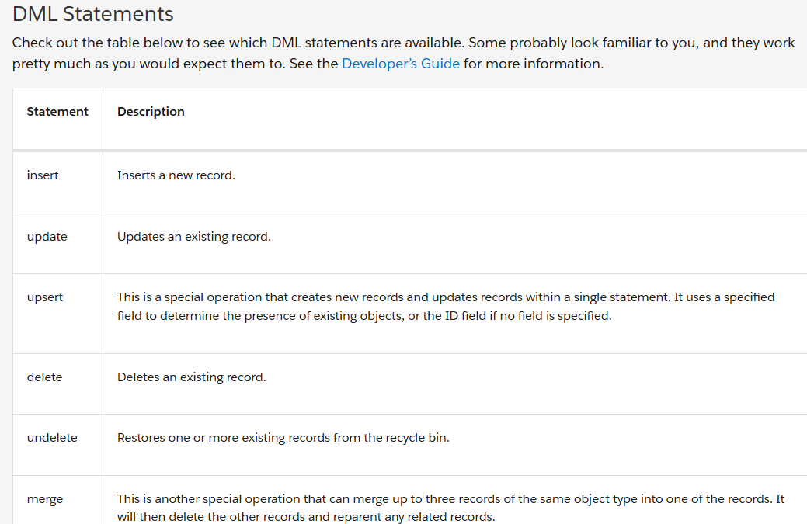
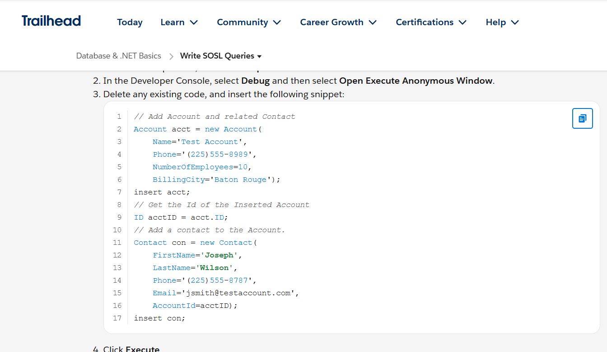
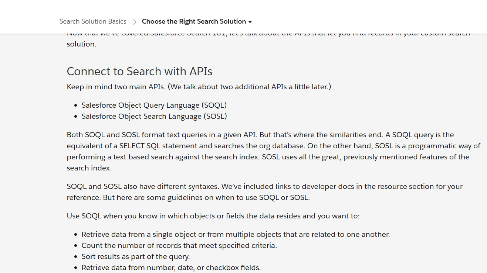
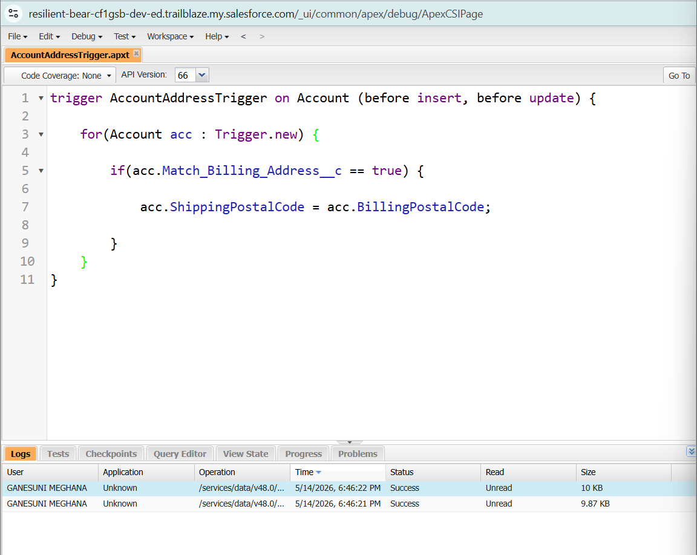
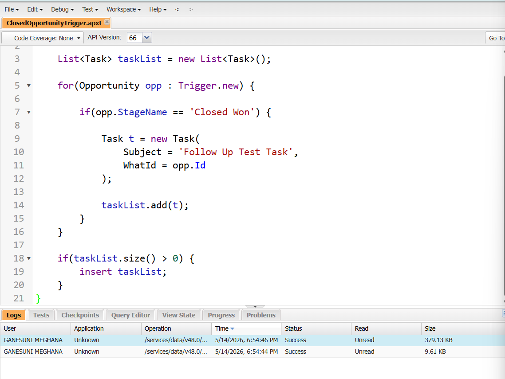

# Salesforce Summer Program – Day 6

## Topics Covered
- SOQL Basics
- SOSL Basics
- DML Operations
- Apex Triggers
- Event-Driven Systems
- Flow vs Trigger
- Search Optimization Basics

---

# 1. What is SOQL?

SOQL (Salesforce Object Query Language) is used to retrieve records from Salesforce databases.

It is similar to SQL but designed specifically for Salesforce objects and relationships.

### Uses of SOQL
- Fetching records
- Filtering data
- Retrieving related records
- Generating reports
- Business data analysis

### Example SOQL Query

```sql
SELECT Name, Email FROM Contact
```

This query retrieves Name and Email fields from the Contact object.

---

# 2. What is an Apex Trigger?

An Apex Trigger is a piece of code that runs automatically when specific events happen in Salesforce.

Triggers help automate business logic based on database actions.

### Trigger Events
- Before Insert
- After Insert
- Before Update
- After Update
- Before Delete
- After Delete

### Example Use Case
When a student registers:
- Automatically send a welcome email
- Create a student ID
- Notify administration

---

# 3. Difference Between Flow and Trigger

| Feature | Flow | Apex Trigger |
|---|---|---|
| Type | Declarative | Programmatic |
| Coding Needed | No | Yes |
| Best For | Simple automation | Complex logic |
| Maintenance | Easier | Requires developer |
| External Integrations | Limited | Powerful |
| Performance | Moderate | Better for complex processing |

---

# 4. Difference Between Before Trigger and After Trigger

| Before Trigger | After Trigger |
|---|---|
| Runs before saving record | Runs after saving record |
| Used for validation/update | Used for related actions |
| Faster for field updates | Used for notifications/tasks |
| Can modify same record | Usually works with related records |

### Example
- Before Trigger:
  Automatically calculate total fee before saving.

- After Trigger:
  Send confirmation email after registration is saved.

---

# 5. Trigger Use Cases (College Management System)

## 1. Student Registration
### Event
After student registration

### Automatic Action
Send welcome email and generate student ID.

---

## 2. Course Capacity Full
### Event
After course enrollment update

### Automatic Action
Notify faculty that course seats are full.

---

## 3. Low Attendance Warning
### Event
After attendance update

### Automatic Action
Send warning message to student and parents.

---

## 4. Fee Payment Completion
### Event
After fee payment update

### Automatic Action
Generate payment receipt automatically.

---

## 5. Exam Result Published
### Event
After marks insertion

### Automatic Action
Notify students that results are available.

---

# 6. Flow vs Trigger Thinking

| Scenario | Use Flow or Trigger? | Reason |
|---|---|---|
| Simple email notification | Flow | Easy configuration without code |
| Complex fee eligibility calculation | Trigger | Requires advanced logic |
| Updating related records | Trigger | Better handling for bulk updates |
| External API integration | Trigger | More control and flexibility |
| Approval notification | Flow | Simple automation process |

---

# 7. Query Thinking

### Student Queries

- Find all students enrolled in Course A
- Find students with attendance below 75%
- Find students who did not pay fees
- Find top-performing students

### Course Queries

- Find all available courses
- Find courses with full capacity
- Find courses handled by Faculty X

### Faculty Queries

- Find faculty teaching more than 3 courses
- Find faculty assigned to Computer Science department

---

# 8. Reflection Task

## Why do enterprise systems need event-driven behavior?

Enterprise systems handle huge amounts of real-time data and business operations.

Event-driven behavior helps systems:
- React automatically to changes
- Reduce manual work
- Improve efficiency
- Ensure faster communication
- Maintain data consistency
- Automate business workflows

Without automation, organizations would waste time performing repetitive manual tasks and may miss critical updates.

Event-driven systems make enterprise applications intelligent, scalable, and efficient.

---

# 9. Search Solution Basics

## What is Search in Salesforce?

Search helps users quickly find records stored inside Salesforce.

### Types of Search
- Global Search
- SOSL Search
- Filter-based Search

### Importance of Search Optimization
- Faster data retrieval
- Better user experience
- Efficient record management
- Improved productivity

---

# 10. Reflective Questions & Answers

## 1. Why do systems need triggers?

Triggers help systems automatically react to important business events without manual intervention.

---

## 2. Difference between polling and event-driven systems?

| Polling | Event-Driven |
|---|---|
| Continuously checks for updates | Reacts only when event occurs |
| Less efficient | More efficient |
| Higher resource usage | Optimized performance |

---

## 3. Why are database queries important?

Queries help retrieve required data quickly and efficiently from large databases.

---

## 4. When should Flows be preferred over Triggers?

Flows should be preferred for:
- Simple automation
- Notifications
- Approval processes
- Basic record updates

---

## 5. What problems happen if automation logic becomes too complex?

- Difficult maintenance
- Performance issues
- Increased bugs
- Harder debugging
- Poor scalability

---

## 6. Why should developers think carefully before automating actions?

Poor automation design can:
- Cause infinite loops
- Slow down systems
- Create incorrect data updates
- Affect business operations negatively

Careful planning ensures reliable and scalable systems.

---
# Screenshots

## DML Statements


---

## SOSL Queries


---

## Search Solution Basics


---

## Apex Triggers


---

## Bulk Apex Triggers



# Day 6 Outcome

By completing Day 6, I understood:

- How Salesforce stores and retrieves data
- Basics of SOQL and SOSL
- How Apex Triggers work
- Event-driven system behavior
- Difference between Flows and Triggers
- Importance of automation in enterprise systems
- Basics of search optimization in Salesforce

---
---

# Status

## ✅ Completed
